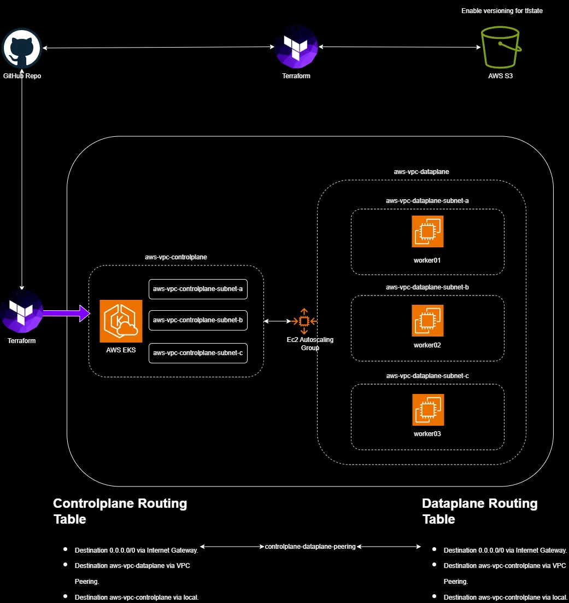

# **Introduction**
This repo deploys a highly available EKS cluster with an Autoscaling Group in region *`us-east-1`* across 3 different Availability Zones.

Because I've used Kodekloud Playgrounds to elaborate this repo, some actions and resources were restricted or had technical limitations.

As consequence, certain actions such as using specific terraform modules, selecting instance types other than *`t2.micro`*, setting custom EKS cluster naming or using an up to date EKS optimized ami, were not possible.

```
📁 /
 ├──📁 terraform/
 |    ├── aws-auth-cm.yaml
 |    ├── controlplane.tf
 |    ├── dataplane.tf
 |    ├── iam.tf
 |    ├── networking.tf
 |    ├── providers.tf
 |    ├── variables.tf
 |    ├── userdata.sh
 ├── script.sh
 ├── kubelet.service
 ├── README.md
```

## **Technologies**:
- AWS: VPCs, Subnetting, Routing Tables, VPC Peering, EKS, Autoscaling Group, EC2, S3, IAM Roles, IAM Policies.
- Git
- Bash
- Kubernetes
- Terraform AWS Provider 

## **Diagram**


# **Prerequisites**
- [AWS CLI with your AWS account](https://docs.aws.amazon.com/cli/latest/userguide/cli-configure-sso.html#sso-configure-profile-token-auto-sso).
- [Terraform with an access key](https://developer.hashicorp.com/terraform/tutorials/aws-get-started/aws-build#prerequisites).
- [kubectl](https://kubernetes.io/docs/tasks/tools/install-kubectl-linux/#install-kubectl-on-linux)

Run *`$ ./script.sh`* to verify if you meet all the prerequisites. The script must be executable *`$ sudo chmod u+x script.sh`*.

The script checks if:
- [AWS CLI](https://docs.aws.amazon.com/cli/latest/userguide/getting-started-install.html) is installed and downdloads if it's not.
- [Terraform](https://developer.hashicorp.com/terraform/tutorials/aws-get-started/install-cli) is installed and downdloads if it's not.
- [kubectl](https://kubernetes.io/docs/tasks/tools/install-kubectl-linux/#install-using-native-package-management) is installed and downdloads if it's not.
- Creates an AWS S3 Bucket with versioning enabled to store the Terraform State. Feel free to modify the var *`BUCKET`* but remember it must match the name of the bucket in the S3 backend, within the *`providers.tf`* file
- Generates a key pair *`dataplane-kp.pem`* and *`dataplane-kp.pem.pub`* for the EC2 Autoscaling Group.

# **Deployment**
Make sure that the script generates a key pair. Alternatively you can generate a new key pair with the commands below.
- *`$ ssh-keygen -t rsa -N "" -f ${HOME}/dataplane-kp.pem`*
- *`$ export TF_VAR_dataplane_public_key=$(cat "dataplane-kp.pem.pub")`*

Navigate into the *`/terraform`* directory and start the terraform deployment cycle. It will take time, so grab a cup of coffee and let it work for 8 minutes or so.

- *`$ terraform init`*
- *`$ terraform plan`*
- *`$ terraform apply`*

Once the deployment is completed, you need to copy the output value *`dataplane-role-arn`* shown in the console and paste it in the *`aws-auth-cm.yaml > rolearn`* field. 

Update kube-config to access the EKS control plane with:
- *`$ aws eks update-kubeconfig --region us-east-1 --name eks-demo`*

Join the dataplane nodes with the Controlplane with *`kubectl`* and allow EKS 60 seconds to detect the autoscaling group.
- *`$ kubectl apply -f aws-auth-cm.yaml`*

# Observations
The worker nodes of the dataplane use an EKS optimized ami that comes with *`bootstrap.sh`* pre installed. However, since this EKS deployment is using kubernetes 1.32 the ami needs an upgrade.

The script *`userdata.sh`* that is passed to the EC2 launch template contains a workaround to make communications between the dataplane and EKS controlplane possible.


📌 🚀 ✅ 1️⃣ 2️⃣ 3️⃣ 🎯 💡 